# Quizze Architecture

This document explains the architecture of Quizze in detail, including the major modules, request flow, data flow, event-driven components, infrastructure dependencies, and observability setup.

## 1. High-Level Overview

Quizze is a full-stack quiz platform built as a modular monolith backend with a separate React frontend. The backend exposes REST APIs for authentication, quiz management, quiz attempts, analytics, monitoring, and notifications.

The project combines:

- synchronous REST APIs for core business flows
- PostgreSQL for primary persistence
- Redis for cache-backed read optimization
- Kafka for asynchronous notification workflows
- Prometheus and Grafana for metrics and dashboards

## 2. High-Level Project Architecture

At a high level, Quizze is organized into five major layers:

1. presentation layer
2. application and business layer
3. persistence layer
4. messaging and notification layer
5. observability layer

### 2.1 High-Level Layered View

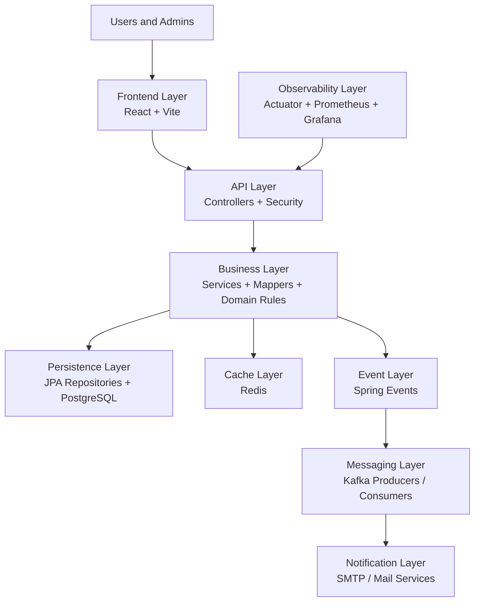

### 2.2 What Each Layer Does

#### Frontend Layer

- renders the user and admin interfaces
- stores JWT after login
- calls backend REST APIs
- separates user and admin experiences through role-aware navigation

#### API Layer

- exposes REST endpoints
- validates requests
- applies authentication and authorization rules
- routes requests into the appropriate service flow

#### Business Layer

- contains the main application logic
- handles quiz creation, attempts, scoring, results, analytics, and audit behavior
- emits internal application events for decoupled workflows

#### Persistence Layer

- persists relational data in PostgreSQL
- stores users, quizzes, questions, options, attempts, answers, OTPs, and audit logs

#### Cache Layer

- uses Redis to speed up expensive read-heavy endpoints
- mainly supports leaderboard and analytics responses

#### Messaging Layer

- uses Kafka for async, non-blocking notification workflows
- handles new quiz publication notifications and quiz result emails

#### Observability Layer

- exposes application health and metrics
- allows Prometheus scraping
- powers Grafana dashboards for system and business visibility

### 2.3 High-Level Runtime View

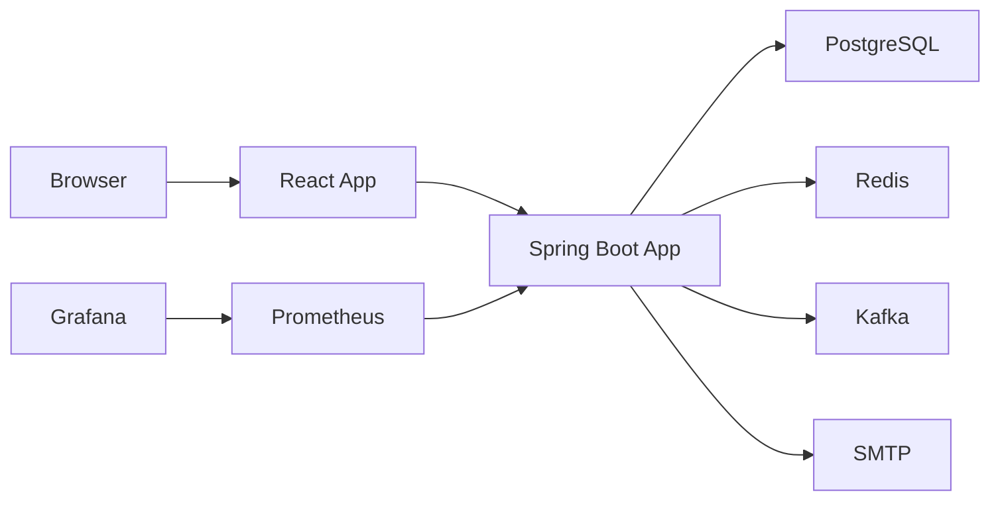

### 2.4 Why This High-Level Structure Works

This design works well for Quizze because it keeps the main application simple enough to manage as a single backend while still supporting production-style concerns:

- secure REST APIs for core product behavior
- clear separation between sync and async workflows
- fast reads through caching
- scalable notification handling through messaging
- strong visibility through metrics and monitoring

## 3. System Context

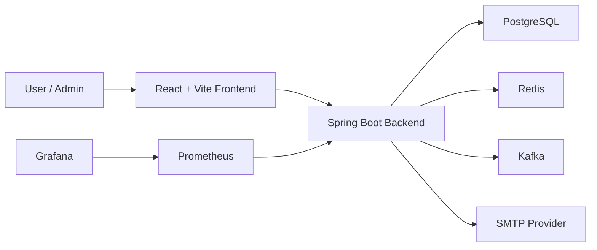

## 4. Architectural Style

The backend follows a modular monolith style.

That means:

- all business capabilities live in one deployable Spring Boot application
- modules are separated by package boundaries and clear responsibilities
- communication inside the app is mostly direct service calls
- some workflows are decoupled using Spring application events
- some workflows are offloaded asynchronously through Kafka

This gives the project a good balance:

- simpler to build and deploy than microservices
- structured enough to show production-style boundaries
- flexible enough to add event-driven workflows without forcing full distributed complexity everywhere

## 5. Backend Module Breakdown

Main backend packages:

- `auth`
- `user`
- `quiz`
- `notification`
- `audit`
- `cache`
- `monitoring`
- `config`
- `common`

### 4.1 Auth Module

Responsibilities:

- registration
- login
- JWT generation and validation
- forgot password OTP flow
- password reset
- registration-time notification preference

Key concepts:

- `AuthController`
- `AuthService`
- JWT service and filter
- password reset OTP persistence
- user registration event publishing

### 4.2 User Module

Responsibilities:

- current user profile
- attempt history
- result history
- personal analytics

Key concepts:

- `UserController`
- `User` entity
- profile and analytics DTO mapping

### 4.3 Quiz Module

Responsibilities:

- quiz CRUD
- question CRUD
- quiz catalog browsing
- attempts and submissions
- scoring
- result review
- leaderboard
- quiz analytics

Key concepts:

- `AdminController`
- `UserQuizController`
- `AdminQuizService`
- `UserQuizService`
- leaderboard and analytics services

### 4.4 Notification Module

Responsibilities:

- welcome email
- password reset OTP email
- new quiz notification emails
- quiz result emails
- Kafka producers and consumers for async notification flows

Key concepts:

- mail configuration
- Kafka payload models
- Kafka producers and listeners
- batch email sending for new quiz notifications

### 4.5 Audit Module

Responsibilities:

- capture admin actions for quiz and question management
- expose audit log history to admins

### 4.6 Cache Module

Responsibilities:

- configure cache manager
- Redis-backed caching
- cache invalidation on quiz writes and submissions

### 4.7 Monitoring Module

Responsibilities:

- custom Micrometer counters
- actuator exposure
- Prometheus integration

## 6. Layered Backend Design

The backend uses a layered structure inside each module.

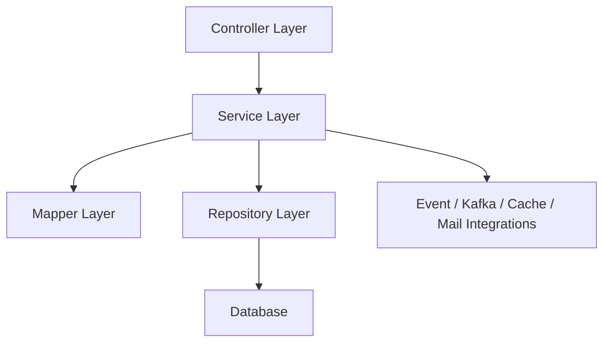

### Controller Layer

Responsibilities:

- define REST endpoints
- validate request input
- enforce HTTP-level concerns
- delegate business logic to services

Examples:

- `AuthController`
- `UserController`
- `AdminController`
- `UserQuizController`

### Service Layer

Responsibilities:

- implement business rules
- coordinate repositories
- publish events
- handle scoring, analytics, and workflow logic

Examples:

- `AuthService`
- `AdminQuizService`
- `UserQuizService`
- analytics services

### Mapper Layer

Responsibilities:

- transform domain models into API response DTOs
- keep controllers and services cleaner
- reduce entity leakage into API contracts

### Repository Layer

Responsibilities:

- data access using Spring Data JPA
- entity persistence and queries

## 7. Request Flow

Below is the typical synchronous request lifecycle.

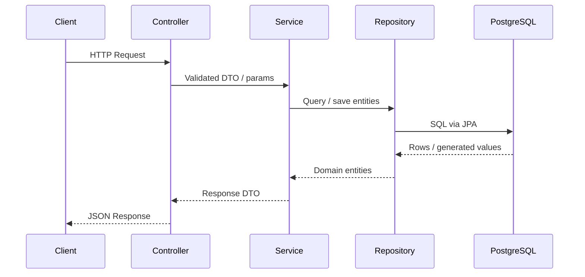

## 8. Authentication and Security Architecture

Quizze uses JWT-based stateless authentication.

### Security Components

- Spring Security filter chain
- JWT authentication filter
- JWT service for token generation and validation
- role-based access control

### Roles

- `USER`
- `ADMIN`

### Access Model

- public endpoints for register, login, forgot password, reset password
- authenticated endpoints for user quiz flows
- admin-only endpoints for quiz management, analytics, and audit logs
- selected actuator endpoints exposed publicly or restricted

### Authentication Flow

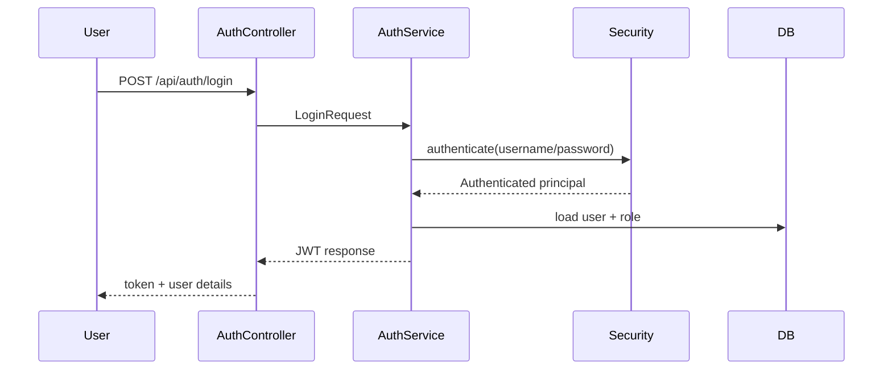

## 9. Domain Model Overview

Main entities:

- `User`
- `Role`
- `Category`
- `Quiz`
- `Question`
- `Option`
- `QuizAttempt`
- `AttemptAnswer`
- `PasswordResetOtp`
- `AdminAuditLog`

## 10. Core Data Relationships

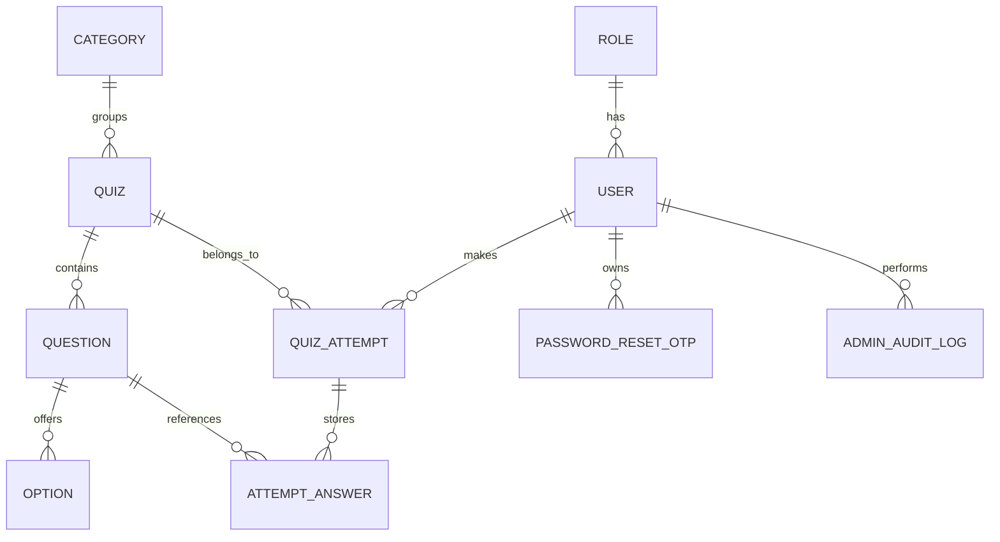

## 11. Database Schema

The primary relational schema is stored in PostgreSQL and centers around users, quizzes, attempts, and supporting operational tables.

### 11.1 Main Tables

#### `roles`

- stores application roles such as `USER` and `ADMIN`

#### `users`

- stores account identity and profile information
- links to a role
- stores account status and new quiz notification preference

Typical fields:

- `id`
- `first_name`
- `last_name`
- `email`
- `username`
- `password`
- `enabled`
- `new_quiz_notifications_enabled`
- `role_id`
- `created_at`
- `updated_at`

#### `categories`

- stores quiz categories such as Java, Spring Boot, SQL

Typical fields:

- `id`
- `name`
- `created_at`

#### `quizzes`

- stores quiz metadata and rules
- links to a category

Typical fields:

- `id`
- `title`
- `description`
- `difficulty`
- `time_limit_in_minutes`
- `published`
- `negative_marking_enabled`
- `one_attempt_only`
- `category_id`
- `created_at`
- `updated_at`

#### `questions`

- stores quiz questions
- links to a quiz

Typical fields:

- `id`
- `content`
- `points`
- `quiz_id`
- `created_at`

#### `options`

- stores possible answers for a question
- exactly one option is correct in the current model

Typical fields:

- `id`
- `content`
- `correct`
- `question_id`

#### `quiz_attempts`

- stores each user attempt for a quiz
- links to both user and quiz
- stores submission state and computed result values

Typical fields:

- `id`
- `user_id`
- `quiz_id`
- `status`
- `started_at`
- `submitted_at`
- `expires_at`
- `score`
- `correct_answers`
- `wrong_answers`
- `question_order_json`

#### `attempt_answers`

- stores submitted answers for each attempt
- links to quiz attempt and question
- stores selected option and correctness snapshot

Typical fields:

- `id`
- `quiz_attempt_id`
- `question_id`
- `selected_option_id`
- `correct`
- `points_awarded`

#### `password_reset_otps`

- stores hashed OTPs for password reset
- links to the user

Typical fields:

- `id`
- `user_id`
- `otp_hash`
- `expires_at`
- `used`
- `invalidated`
- `failed_attempts`
- `created_at`

#### `admin_audit_logs`

- stores admin mutation history for governance and traceability

Typical fields:

- `id`
- `admin_user_id`
- `action_type`
- `target_type`
- `target_id`
- `target_name`
- `description`
- `created_at`

### 11.2 Relational Schema Diagram

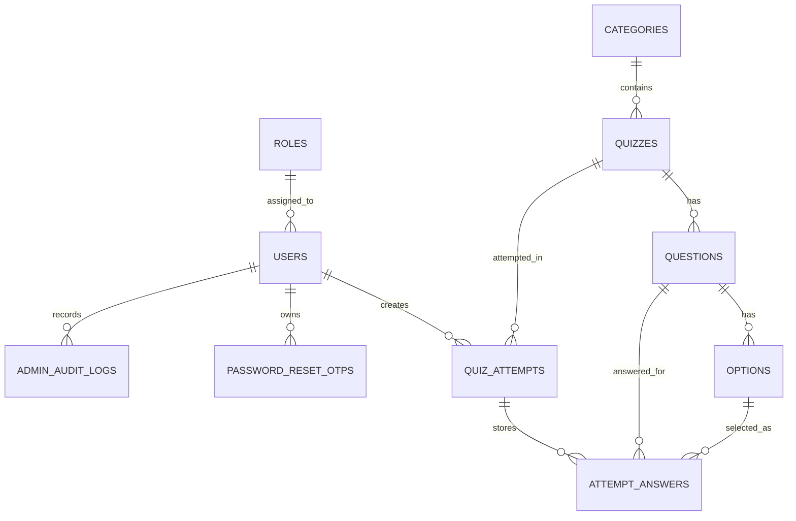

### 11.3 Schema Design Notes

#### Separation of quiz definition and quiz execution

- `quizzes`, `questions`, and `options` define the content
- `quiz_attempts` and `attempt_answers` store runtime activity and results

This separation keeps quiz content stable while allowing multiple users and multiple attempts to generate independent result data.

#### Why attempts store computed result fields

`quiz_attempts` stores values like:

- `score`
- `correct_answers`
- `wrong_answers`
- timestamps

This avoids recalculating the full attempt every time the result, leaderboard, or analytics endpoints are called.

#### Why answers are stored separately

`attempt_answers` makes it possible to:

- review detailed question-by-question results
- calculate hardest and easiest questions
- rebuild user result summaries
- support leaderboard and analytics with historical accuracy

#### Why notification and audit tables are separate

- `password_reset_otps` has a short-lived security purpose
- `admin_audit_logs` has an operational traceability purpose

Keeping them separate keeps the schema cleaner and aligns with single-responsibility design.

### 11.4 Data Lifecycle Summary

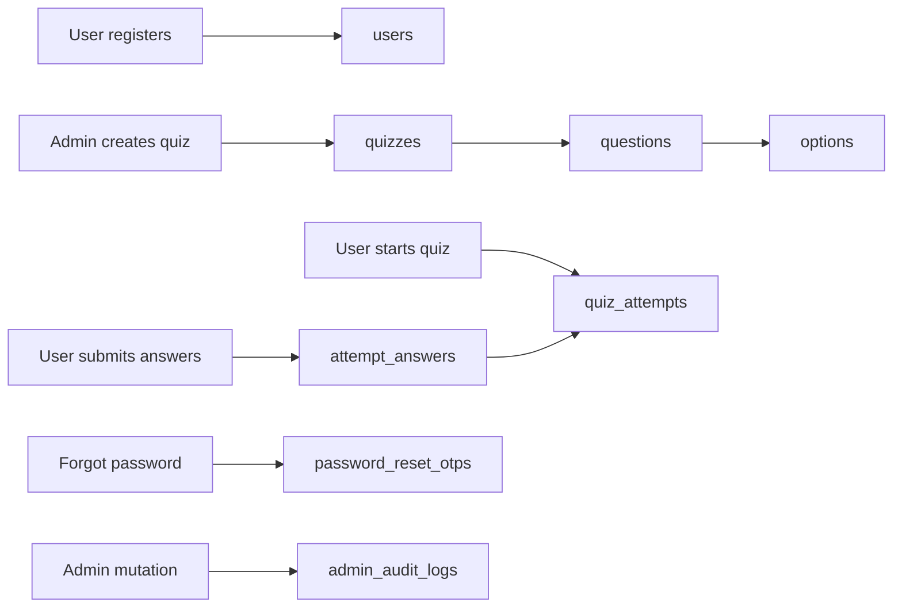

## 12. Quiz Attempt and Scoring Flow

The quiz lifecycle for a user is:

1. fetch published quizzes
2. open quiz details
3. start attempt
4. fetch attempt questions
5. answer and submit
6. score attempt
7. store result
8. review answers and leaderboard

### Attempt Submission Flow

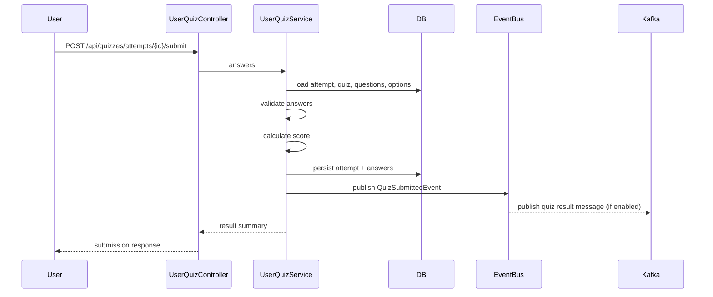

### Scoring Rules

Current behavior includes:

- auto-evaluation of submitted answers
- support for negative marking
- score clamped to valid readable result values
- correct and wrong answer counts
- detailed review response with correct answers

## 13. Analytics Architecture

Analytics are built from persisted quiz attempts and answers.

There are several analytics layers:

- leaderboard per quiz
- per-quiz performance analytics
- hardest/easiest question analytics
- global admin overview
- personal user analytics

### Analytics Read Path

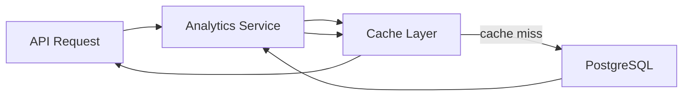

This pattern is useful for:

- leaderboard
- overview analytics
- quiz analytics
- question analytics
- user analytics

## 14. Cache Architecture

Redis is used to improve performance for expensive read-heavy endpoints.

Cached areas include:

- leaderboard
- admin overview analytics
- quiz performance analytics
- question analytics
- user analytics

### Cache Strategy

- cache read-heavy derived data
- invalidate on writes
- invalidate on quiz submission
- invalidate on quiz or question management changes

### Cache Invalidation Flow

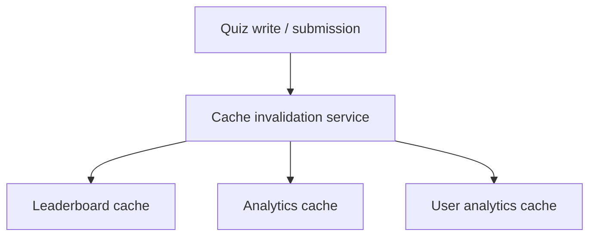

## 15. Event-Driven Design

The project uses two levels of event-driven behavior.

### 13.1 In-Process Spring Events

Used when:

- producer and consumer are inside the same app
- decoupling is useful
- durability is not required

Examples:

- `UserRegisteredEvent`
- `QuizSubmittedEvent`
- `QuizPublishedEvent`

### 13.2 Kafka Events

Used when:

- async processing is preferred
- email sending should not block core requests
- fan-out behavior is useful
- failures should not break request handling

Examples:

- new quiz published notifications
- quiz result notification emails

## 16. Event Flow Diagrams

### User Registration Event

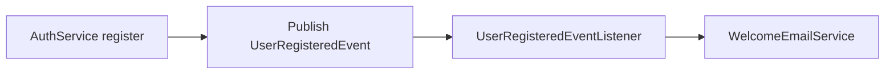

### New Quiz Notification Flow

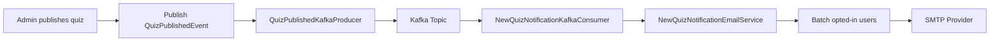

### Quiz Result Notification Flow

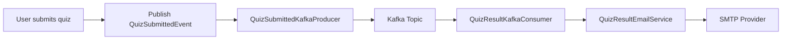

## 17. Notification Architecture

Notifications are configurable and resilient.

### Design Goals

- do not block admin publish flow on email
- do not block quiz submission on email
- allow feature toggles by config
- retry without crashing Kafka consumers
- process new quiz emails in batches
- only notify opted-in users

### Notification Preferences

At registration, users can choose whether they want notifications for new quizzes.

This preference is stored in the `User` entity and used later by the batch email notification flow.

## 18. Audit Logging Architecture

Admin actions are persisted into an audit log table.

Tracked actions include:

- quiz create
- quiz update
- quiz delete
- question create
- question update
- question delete

Each audit entry stores details such as:

- admin user
- action type
- target type
- target id
- description
- timestamp

## 19. Monitoring and Observability

The app exposes operational and business metrics through Spring Boot Actuator and Micrometer.

### Exposed Endpoints

- `/actuator/health`
- `/actuator/info`
- `/actuator/metrics`
- `/actuator/prometheus`

### Custom Metrics

Examples include:

- successful registrations
- successful logins
- password reset requests
- quiz attempts started
- quiz attempts submitted
- Kafka publish success/failure
- Kafka consume success/failure
- new quiz email sent/failed
- quiz result email sent/failed

### Monitoring Stack

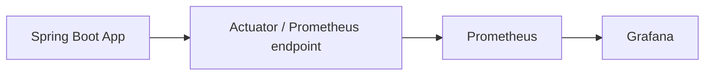

Provisioned dashboards:

- `Quizze Overview`
- `Quizze Messaging & Cache`

## 20. Frontend Architecture

The frontend is a React + Vite single-page application.

Responsibilities:

- authentication flow
- role-based navigation
- user dashboard
- quiz catalog and filtering
- quiz attempt UI
- result review UI
- admin dashboard and management screens
- analytics presentation

### Frontend-to-Backend Interaction

- frontend stores JWT after login
- authenticated API calls include `Authorization: Bearer <token>`
- UI changes based on role
- admin and user experiences are separated in navigation and routes
