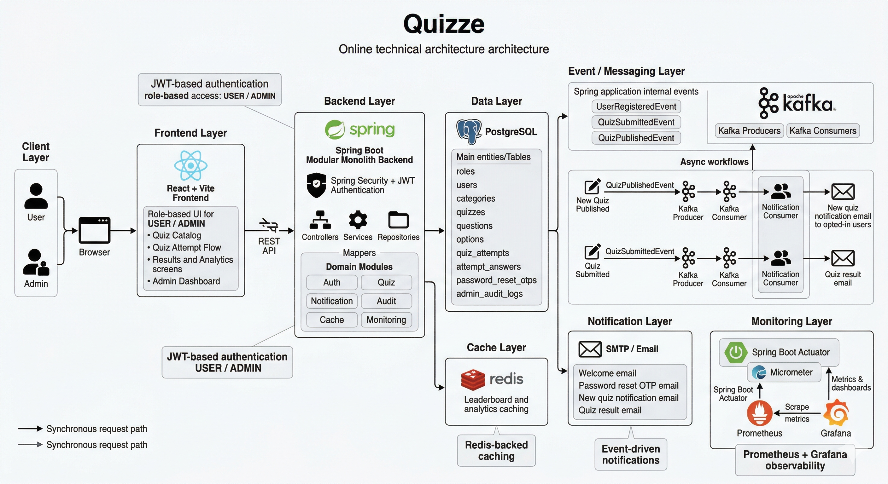

# Quizze

Quizze is a full-stack online quiz platform built with Spring Boot, PostgreSQL, React, and Vite. It supports secure authentication, role-based admin and user workflows, quiz creation and attempts, auto-scoring, analytics, monitoring, caching, and event-driven notifications.

## Highlights

- JWT authentication with `USER` and `ADMIN` roles
- Admin quiz management with question and option CRUD
- Published quiz catalog with filters, sorting, pagination, and one-attempt rules
- Quiz attempt flow with timer support, answer review, result history, and leaderboard
- Admin analytics for quiz performance, hardest/easiest questions, and platform overview
- Password reset with email OTP and resend cooldown
- New quiz notifications and quiz result emails
- Swagger / OpenAPI documentation
- Redis-backed caching for analytics and leaderboard reads
- Kafka-based asynchronous notification flow
- Prometheus metrics and Grafana dashboards
- Unit tests for services and integration tests for APIs

## Tech Stack

### Backend

- Java 21
- Spring Boot 3
- Spring Security
- Spring Data JPA
- Spring Validation
- Spring Mail
- Spring Kafka
- Spring Boot Actuator
- Micrometer + Prometheus
- PostgreSQL
- Redis

### Frontend

- React 18
- Vite
- React Router
- Custom dark SaaS-style UI

### Tooling

- Maven
- Docker Compose
- Grafana
- H2 for tests
- JUnit 5
- Mockito

## Core Features

### Authentication

- Register and login with JWT
- Protected routes for user and admin roles
- Forgot password flow with OTP verification via email
- Optional opt-in for new quiz notifications during registration

### User Experience

- Browse published quizzes
- Search, filter, sort, and paginate the quiz catalog
- Start quiz attempts and answer questions
- Review results with correct answers
- View attempt history and personal analytics
- See leaderboard rankings for quizzes

### Admin Experience

- Create, update, publish, and delete quizzes
- Manage questions and answer options
- View leaderboard and quiz analytics
- Track hardest and easiest questions
- See global platform overview metrics
- Review admin audit logs

### Event-Driven Workflows

- `UserRegisteredEvent` triggers welcome email handling
- `QuizSubmittedEvent` is used internally for decoupled post-submit work
- Kafka publishes new-quiz and quiz-result notification messages
- Kafka consumers process emails asynchronously without blocking core flows

### Observability

- Actuator health and metrics endpoints
- Prometheus scraping
- Grafana dashboards for app metrics and messaging/cache visibility
- Custom counters for auth, quiz flow, Kafka publishing/consuming, and notifications

## Architecture Overview

The project follows a modular monolith backend structure with clear separation between controller, service, mapper, repository, domain, and configuration layers.



## Project Structure

```text
Quizze/
|- src/main/java/com/quizze/quizze
|  |- auth
|  |- user
|  |- quiz
|  |- notification
|  |- audit
|  |- cache
|  |- config
|  |- monitoring
|- src/main/resources
|- src/test
|- frontend
|- monitoring
|  |- grafana
|  |- prometheus.yml
|- docker-compose.kafka.yml
|- .env.example
```


## API Endpoint 

### Public Auth Endpoints

| Method | Endpoint | Purpose |
| --- | --- | --- |
| `POST` | `/api/auth/register` | Register a new user account |
| `POST` | `/api/auth/login` | Authenticate and receive a JWT |
| `POST` | `/api/auth/forgot-password` | Request a password reset OTP |
| `POST` | `/api/auth/reset-password` | Reset password with email + OTP |

### User Endpoints

| Method | Endpoint | Purpose |
| --- | --- | --- |
| `GET` | `/api/users/me` | Get current user profile |
| `GET` | `/api/users/me/attempts` | Get attempt history |
| `GET` | `/api/users/me/results` | Get result summaries |
| `GET` | `/api/users/me/analytics` | Get personal performance analytics |
| `GET` | `/api/quizzes` | List published quizzes with filters, sorting, and pagination |
| `GET` | `/api/quizzes/{id}` | Get published quiz details |
| `GET` | `/api/quizzes/{id}/leaderboard` | Get quiz leaderboard |
| `POST` | `/api/quizzes/{id}/start` | Start a quiz attempt |
| `GET` | `/api/quizzes/attempts/{attemptId}/questions` | Get attempt questions without correct answers |
| `POST` | `/api/quizzes/attempts/{attemptId}/submit` | Submit quiz answers |
| `GET` | `/api/quizzes/attempts/{attemptId}/result` | Get detailed result review |

### Admin Endpoints

| Method | Endpoint | Purpose |
| --- | --- | --- |
| `GET` | `/api/admin/access-check` | Verify admin access |
| `GET` | `/api/admin/analytics/overview` | Get overall platform analytics |
| `GET` | `/api/admin/audit-logs` | Get recent admin audit logs |
| `GET` | `/api/admin/quizzes` | List all quizzes for admin management |
| `GET` | `/api/admin/quizzes/{id}` | Get quiz details for editing |
| `GET` | `/api/admin/quizzes/{id}/leaderboard` | Get admin quiz leaderboard |
| `GET` | `/api/admin/quizzes/{id}/analytics` | Get quiz performance analytics |
| `GET` | `/api/admin/quizzes/{id}/questions/analytics` | Get hardest and easiest questions |
| `POST` | `/api/admin/quizzes` | Create a new quiz |
| `PUT` | `/api/admin/quizzes/{id}` | Update a quiz |
| `DELETE` | `/api/admin/quizzes/{id}` | Delete a quiz |
| `POST` | `/api/admin/quizzes/{id}/questions` | Add a question to a quiz |
| `PUT` | `/api/admin/questions/{id}` | Update a question |
| `DELETE` | `/api/admin/questions/{id}` | Delete a question |

### Monitoring Endpoints

| Method | Endpoint | Purpose |
| --- | --- | --- |
| `GET` | `/actuator/health` | Health check |
| `GET` | `/actuator/prometheus` | Prometheus scrape endpoint |
| `GET` | `/actuator/info` | Application info |
| `GET` | `/actuator/metrics` | Metrics index |
| `GET` | `/actuator/metrics/{name}` | Metric details |

## Environment Variables

Main environment variables are documented in [.env.example](/C:/Users/Niranjan/Desktop/Quizze/.env.example).

Important groups:

- Application and DB config
- JWT settings
- Mail settings
- Redis config
- Kafka bootstrap and listener toggles
- New quiz notification settings
- Quiz result notification settings

## Docker Backend

To run the backend with containerized PostgreSQL, Redis, and Kafka:

```powershell
docker compose -f docker-compose.backend.yml up --build
```

This starts:

- backend on `http://localhost:9090`
- PostgreSQL on `localhost:5432`
- Redis on `localhost:6379`
- Kafka on `localhost:9092`

Notes:

- the backend container uses the `dev` Spring profile by default
- `DB_URL`, `DB_USERNAME`, and `DB_PASSWORD` are wired to the internal PostgreSQL service automatically
- Redis and Kafka are available in the stack, but the app only uses them when the related feature flags in `.env` are enabled

## Messaging and Notification Flow

### New quiz notifications

1. Admin publishes a quiz
2. Backend emits a `QuizPublishedEvent`
3. Kafka producer publishes a message
4. Kafka consumer processes opted-in users in batches
5. Notification email sending is retried and failures are logged without crashing the consumer

### Quiz result notifications

1. User submits a quiz
2. Backend scores the attempt
3. `QuizSubmittedEvent` is emitted
4. Kafka producer publishes a result message
5. Kafka consumer sends the result summary email asynchronously

## Metrics and Monitoring

The app exposes:

- JVM metrics
- HTTP request metrics
- custom auth counters
- custom quiz attempt counters
- Kafka publish / consume counters
- notification email success / failure counters
- cache activity metrics

Provisioned Grafana dashboards:

- `Quizze Overview`
- `Quizze Messaging & Cache`

## Testing

Current test coverage includes:

- service unit tests
- authentication API integration tests
- user quiz flow integration tests

